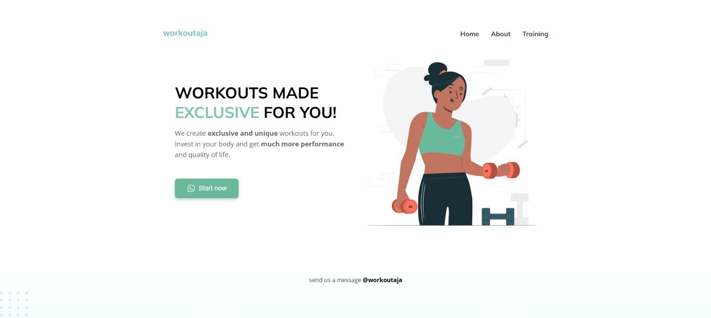

# Soal 3 - Debugging dan Styling CSS

Proyek ini merupakan bagian dari Ujian Tengah Semester (UTS) mata kuliah Web Client Development. Tugas pada soal 3 berfokus pada debugging dan penyempurnaan styling CSS dari sebuah halaman web bertema kebugaran.

## Deskripsi

Halaman web ini bertujuan untuk mempromosikan layanan workout eksklusif dengan tampilan modern dan responsif. Proyek melibatkan:

* Perbaikan dan penyesuaian struktur HTML.
* Debugging kode JavaScript agar berjalan sesuai fungsi.
* Styling ulang CSS untuk menciptakan layout yang rapi, konsisten, dan menarik.

## Fitur

* Tampilan responsif untuk desktop dan perangkat mobile.
* Desain bersih dan minimalis dengan ilustrasi vektor (SVG).
* Fokus pada typography dan white space untuk meningkatkan keterbacaan.
* Navigasi sederhana dengan menu: *Home, **About, dan **Training*.
* Tombol CTA (Call to Action) “Start now” untuk meningkatkan engagement pengguna.

## Teknologi

* *HTML5* untuk struktur konten.
* *CSS3* untuk styling dan layout.
* *JavaScript* untuk interaktivitas (opsional).
* Aset gambar berbasis *SVG* untuk visual berkualitas tinggi dan ringan.

## Screenshot

Berikut tampilan utama dari website:

 <!-- Jika ada screenshot -->

## Artikel Medium

📝 Artikel Medium: [Penggunaan HTML, CSS, & JavaScript dalam Website](https://medium.com/@putraliadli/penggunaan-html-css-javascript-dalam-website-341d27698173)
